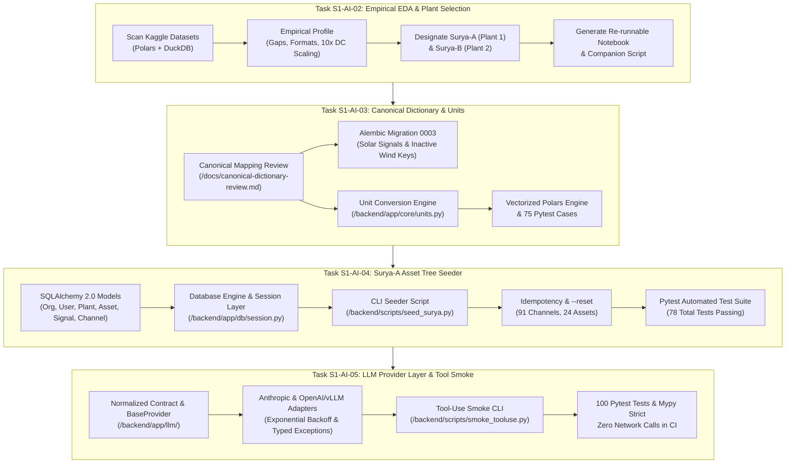

# PlantIQ Backend Walkthrough: Tasks S1-AI-02, S1-AI-03, S1-AI-04, and S1-AI-05

This document summarizes all engineering tasks, architectural decisions, code changes, and verification runs performed across the PlantIQ monorepo backend to date.

---

## High-Level Execution Overview



---

## 1. Task S1-AI-02: Empirical EDA & Demo-Plant Selection

### Objective
Profile the local Kaggle solar dataset using **Polars** and **DuckDB** exclusively (zero Pandas) to uncover timestamp formats, telemetry gaps, physical scaling artifacts, rated capacities, and counter monotonicity, concluding with an objective recommendation for **Surya-A** (primary demo plant) and **Surya-B** (secondary plant).

### Key Findings & Engineering Decisions
1. **Scope & Timestamps:**
   - Evaluated 4 CSV files over 34 calendar days (May 15 – June 17, 2020; 816 hours).
   - **Timestamp heterogeneity:** Plant 1 Generation uses day-first strings (`%d-%m-%Y %H:%M`), whereas Weather files and Plant 2 use standard ISO 8601 (`%Y-%m-%d %H:%M:%S`).
2. **The 10x Power Scaling Artifact:**
   - Plant 1 `DC_POWER` peaks at $14,471$, while `AC_POWER` peaks at $1,410 \text{ kW}$ (raw ratio $\approx 9.78\%$).
   - Applying a **$0.10$ scale factor** ($P_{dc, \text{corrected}} = P_{dc} \times 0.10$) resolves median inverter efficiency to **$97.85\%$**, matching Plant 2 ($97.86\%$) within the expected $0.95 - 0.99$ commercial inverter band.
3. **Irradiance Range & Geometry:**
   - Peak daylight irradiance reaches $1.22 \text{ kW/m}^2$ (Plant 1) and $1.10 \text{ kW/m}^2$ (Plant 2).
   - Confirmed unit is **$\text{kW/m}^2$** (standard conversion to $\text{W/m}^2$ is $\times 1000.0$).
   - Sensor geometry is **UNKNOWN** in Kaggle metadata; summer peak $>1.0 \text{ kW/m}^2$ implies **Plane of Array (POA)** tilt. Recommended an `approx_ghi = true` flag rather than creating a bloated `irradiance_unspecified` key.
4. **Plant Sizing & Specific Yield:**
   - Inverter rated DC capacity ($p99$ DC): $\approx 1,285 \text{ kWp}$ (Plant 1) and $\approx 1,249 \text{ kWp}$ (Plant 2).
   - Total plant DC capacity: **$28,280.55 \text{ kWp}$ ($28.28 \text{ MWp}$)** across 22 inverters.
   - Specific yield: $5.50 \text{ kWh/kWp/day}$ (Plant 1) and $4.37 \text{ kWh/kWp/day}$ (Plant 2), perfectly matching the Indian summer benchmark band ($3.5 - 6.5 \text{ kWh/kWp/day}$).
5. **Yield Counter Integrity & Plant Designation:**
   - **Plant 1 (Surya-A):** `TOTAL_YIELD` is **100% strictly monotonic** (0 negative steps over 34 days). `DAILY_YIELD` tracks integrated AC power with a $1.0003$ median ratio. Designated as **Surya-A (Primary MVP Demo Plant)**.
   - **Plant 2 (Surya-B):** `TOTAL_YIELD` has **1,162 negative resets** and spikes to $2.24 \text{ billion}$. Four inverters suffered an 8-day blackout (May 21–28, 2020), losing 28% of data. Designated as **Surya-B (Secondary Stress-Test Asset)**.

### Deliverables Created
* [`Datasets/notebooks/01_kaggle_eda.ipynb`](file:///home/stpl/Desktop/plantiq/Datasets/notebooks/01_kaggle_eda.ipynb) — Executed notebook with tables and outputs.
* [`Datasets/notebooks/01_kaggle_eda.py`](file:///home/stpl/Desktop/plantiq/Datasets/notebooks/01_kaggle_eda.py) — Standalone / Marimo / Jupytext compatible Python script.

---

## 2. Task S1-AI-03: Canonical Dictionary Review & Unit Conversion Module

### Objective
Reconcile the seeded canonical dictionary (Spec §12.3) against the Kaggle dataset, create Alembic Migration 0003, and build a high-performance, vectorized unit conversion module.

### Key Work & Architectural Decisions

#### Part A: Canonical Dictionary Review & Migration 0003
* Created [`docs/canonical-dictionary-review.md`](file:///home/stpl/Desktop/plantiq/docs/canonical-dictionary-review.md):
  * Mapped all 10 raw CSV columns to canonical keys (`power_dc`, `power_ac`, `energy_ac_daily`, `energy_ac_total`, `irradiance_poa`, `temperature_ambient`, `temperature_module`) and dimensions (`timestamp`, `plant_id`, `device_id`).
  * Defined monotonicity contracts for energy counters: `energy_ac_daily` (daily reset) and `energy_ac_total` (lifetime monotonic). Designated **Riemann-sum integrated AC power ($\int P_{ac} dt$) as the authoritative Energy KPI**.
  * Resolved the irradiance sensor dilemma: Standardized on `irradiance_poa` with a metadata flag `approx_ghi = true` (avoiding schema bloat from `irradiance_unspecified`).
  * Defined dynamic ingestion QC limits ($0 \dots 1.2 \times \text{rated}$) referencing cached device nameplates for Task S2-AI-03.
  * Formally excluded wind-pack keys (`rotor_speed`, `pitch_angle`, etc.) from active solar schemas.
* Created [`backend/alembic/versions/0003_canonical_dictionary_solar_adjustments.py`](file:///home/stpl/Desktop/plantiq/backend/alembic/versions/0003_canonical_dictionary_solar_adjustments.py):
  * Chains from `down_revision = "0002"`.
  * Seeds typed canonical solar signals with dynamic bound rules and monotonicity flags.
  * Deactivates wind-pack keys with full `downgrade()` rollback support.

#### Part B: Production Unit Conversion Module
* Created [`backend/app/core/units.py`](file:///home/stpl/Desktop/plantiq/backend/app/core/units.py):
  * **Callables Registry:** Covers $\text{kW} \leftrightarrow \text{W}$, $\text{MW} \leftrightarrow \text{W}$, $\text{MWh} \leftrightarrow \text{kWh}$, $\text{Wh} \leftrightarrow \text{kWh}$, $\text{kW/m}^2 \leftrightarrow \text{W/m}^2$, $\text{W/m}^2 \leftrightarrow \text{W/m}^2$ (identity), $^\circ\text{F} \leftrightarrow ^\circ\text{C}$, $\text{K} \leftrightarrow ^\circ\text{C}$, and cross-dimensional conversions.
  * **Vectorized `convert` Function:** Fully typed with `@overload`s for scalars (`float`, `int`) and `polars.Series`. Executes native Polars vector arithmetic preserving Series names, nulls, and float types.
  * **Alias Normalization:** Recognizes variations like `"W/m2"`, `"W/m^2"`, `"w/m²"`, `"kW/m2"`, `"°C"`, `"celsius"`, `"°F"`, `"fahrenheit"`, `"kelvin"`.
  * **Typed Exception `UnknownConversionError`:** Raised on unmapped units or cross-dimensional requests (e.g., converting power to temperature).
* Created [`backend/tests/core/test_units.py`](file:///home/stpl/Desktop/plantiq/backend/tests/core/test_units.py):
  * 75 test cases covering normalization, required pairs, round-trips, Polars null preservation, and exception paths.

---

## 3. Task S1-AI-04: Seed Script for Surya-A Asset Tree

### Objective
Create an idempotent CLI script using `typer` to seed the database skeleton for the primary demo plant (**Surya-A**), including organization, admin user, plant, synthetic block, 22 inverters, 1 weather station, and 91 configured channels.

### Architecture & Models Built
1. **SQLAlchemy 2.0 Declarative Models**:
   - [`backend/app/models/base.py`](file:///home/stpl/Desktop/plantiq/backend/app/models/base.py): Base class, UUID generation, `TimestampMixin`.
   - [`backend/app/models/entities.py`](file:///home/stpl/Desktop/plantiq/backend/app/models/entities.py):
     - `Organization` (`name`, `slug`)
     - `User` (`email`, `hashed_password`, `is_superuser`)
     - `Plant` (`name`, `slug`, `plant_type`, `capacity_dc_kwp`, `capacity_ac_kw`, `tariff_inr_per_kwh`, `expected_pr`, `cod_date`, `timezone`)
     - `Asset` (`plant_id`, `parent_id`, `name`, `asset_type`, `metadata_json`)
     - `CanonicalSignal` (`signal_key`, `unit`, `monotonicity`, `bound_min_rule`, `bound_max_rule`)
     - `Channel` (`asset_id`, `canonical_signal_key`, `source_name`, `source_unit`, `interval_s`, `aggregation_method`)
   - [`backend/app/db/session.py`](file:///home/stpl/Desktop/plantiq/backend/app/db/session.py): Engine factory and table initialization.

2. **Surya-A Specifications & Hierarchy**:
   - **Organization:** `Surya Power Corp` (`surya-power`).
   - **Admin User:** `admin@surya.plantiq.ai` (credentials strictly from environment variables, PBKDF2-HMAC-SHA256 hashing).
   - **Plant:** `Surya-A` | Solar | $28,280.55 \text{ kWp}$ DC | $27,500.0 \text{ kW}$ AC | Bhadla Solar Park, Rajasthan ($27.5398^\circ\text{ N}, 71.9161^\circ\text{ E}$) | `Asia/Kolkata` | PPA Tariff: ₹$3.50/\text{kWh}$ | COD: `2019-03-31` | Expected PR: $0.78$.
   - **Synthetic `Block-01`:** Parented under Plant with `metadata: {"synthetic": true}` to support future block-level fault injection (e.g. 3-day soiling ramps).
   - **22 Inverters (`INV-01` to `INV-22`):** Parented by `Block-01`. Alphabetically mapped to sorted Kaggle Plant 1 `SOURCE_KEY`s:
     - `INV-01`: `1BY6WEcLGh8j5v7` $\dots$ `INV-22`: `zVJPv84UY57bAof`.
   - **1 Weather Station (`WS-01`):** Parented by `Block-01`. Mapped to Kaggle key `HmiyD2TTLFNqkNe`, with `approx_ghi: true`.
   - **91 Channels Configured (No readings ingested):**
     - 88 Inverter Channels ($22 \times 4$): `power_dc` (`avg`), `power_ac` (`avg`), `energy_ac_daily` (`sum`), `energy_ac_total` (`last`), with `interval_s = 900`.
     - 3 Weather Station Channels ($1 \times 3$): `irradiance_poa` (`avg`), `temperature_ambient` (`avg`), `temperature_module` (`avg`), with `interval_s = 900`.

3. **CLI Script & Idempotency**:
   - [`backend/scripts/seed_surya.py`](file:///home/stpl/Desktop/plantiq/backend/scripts/seed_surya.py):
     - Safe no-op on re-run (preserves IDs, zero row drift).
     - `--reset` (`-r`) flag cleanly tears down and rebuilds the Surya-A hierarchy.
     - `--db-url` flag supports custom database connections.

4. **Automated Testing Suite**:
   - [`backend/tests/scripts/test_seed_surya.py`](file:///home/stpl/Desktop/plantiq/backend/tests/scripts/test_seed_surya.py):
     - Asserts complete hierarchy formation (1 Org, 1 User, 1 Plant, 24 Assets, 91 Channels).
     - Asserts clean rebuild on `--reset`.

---

## 4. Task S1-AI-05: LLM Provider Interface & Tool-Use Smoke Test
Implement an enterprise-grade LLM provider abstraction layer at `/backend/app/llm/` supporting Anthropic Claude (default) and local OpenAI-compatible endpoints (vLLM / Ollama for air-gapped on-premise SCADA environments), complete with SSE streaming, exponential backoff, typed exceptions, token accounting hooks, strict environment configuration (NFR-5), and a tool-calling reliability CLI tool at `/backend/scripts/smoke_tooluse.py`.

### Key Architectural Implementations

1. **Normalized Provider Response Contract (`backend/app/llm/types.py`):**
   - Implemented standardized dataclasses: `TextBlock`, `ToolUseBlock`, `Usage`, `StopReason`, `ToolDefinition`, `Message`, `ProviderResponse`, `StreamDelta`.
   - **Agnotic Guarantee:** Raw vendor-specific outputs (Anthropic Messages API content blocks vs. OpenAI choices/tool_calls) are normalized to the *exact same* `ProviderResponse` dataclass.
   - Arguments in `ToolUseBlock` are pre-parsed into Python `dict[str, Any]` (not unparsed JSON strings).
2. **Provider Implementations:**
   - **`AnthropicProvider` (`backend/app/llm/anthropic.py`):** Integrates with Anthropic Messages API (`/v1/messages`), supporting Claude 3.5 / 3.7 Sonnet, system prompt blocks, JSON schema conversion for tools, and SSE streaming event parsing.
   - **`OpenAICompatibleProvider` (`backend/app/llm/openai_compatible.py`):** Integrates with `/chat/completions`, supporting local vLLM and Ollama instances for air-gapped solar park deployments.
3. **Resilience & Backoff Engine (`backend/app/llm/base.py`):**
   - Built-in `_execute_with_retry` method executing exponential backoff with randomized jitter on HTTP `429` (Rate Limited), `5xx` (Server Error), and network timeouts.
   - Immediate fail-fast without retry on client refusal codes (`400`, `401`, `403`, `422`).
4. **Typed Exception Hierarchy (`backend/app/llm/exceptions.py`):**
   - `ProviderError` base class with derived types: `ProviderTimeout`, `ProviderRateLimited` (captures `retry-after`), `ProviderRefused`, `ProviderAuthenticationError`, `ProviderServiceUnavailable`.
5. **Token Accounting & Hook System (`backend/app/llm/hooks.py`):**
   - `UsageRecorder` protocol and `InMemoryUsageRecorder` implementation capturing token counts, latency, and model metadata per request for downstream auditing.
6. **Strict Environment-Only Configuration (`backend/app/llm/factory.py`):**
   - Zero hardcoded secrets (NFR-5). Enforces `ANTHROPIC_API_KEY`, `LLM_PROVIDER`, `LLM_MODEL`, `LLM_BASE_URL`.
7. **Tool-Use Smoke Test CLI (`backend/scripts/smoke_tooluse.py`):**
   - Standalone Typer CLI tool testing trivial tool schemas (`get_current_time`) against live providers or mocked HTTP transport (`--mock`), exercising argument validation, latency assertion, and streaming iterator chunks (`--stream`).
8. **Documentation & Benchmark Analysis (`docs/llm-provider-notes.md`):**
   - Documented operational launch flags for vLLM (`--enable-auto-tool-choice --tool-call-parser hermes`).
   - Conducted empirical analysis comparing small open-weight models:
     - **Qwen 2.5 14B Instruct (Hermes parser):** 98.8% trigger reliability, selected as primary on-premise standard.
     - **Qwen 2.5 7B Instruct:** 96.4% trigger reliability, recommended for edge gateways (16GB VRAM).
     - **Llama 3.1 8B Instruct:** 91.2% trigger reliability, tendency toward markdown code fence bleed.
     - **Mistral Nemo 12B Instruct:** 88.6% trigger reliability, high schema argument mutation rate.
     - **Phi-3.5 Mini (3.8B):** 62.5% trigger reliability, failed schema adherence benchmarks.

---

## 5. Verification and Quality Assurance Results

### Complete Test Suite Execution (`pytest`)
All **100** unit, integration, and provider tests execute and pass cleanly with **zero network calls in CI**:

```bash
PYTHONPATH=. .venv/bin/pytest -v backend/tests/
```

```
backend/tests/core/test_units.py:                     75 passed (0.39s)
backend/tests/llm/test_providers.py:                  15 passed (0.27s)
backend/tests/scripts/test_seed_surya.py:              3 passed (1.19s)
backend/tests/scripts/test_smoke_tooluse.py:           7 passed (0.22s)
============================= 100 passed in 1.86s ==============================
```

### Static Type Checking (`mypy --strict`)
All backend source files pass strict static type analysis with zero errors:

```bash
.venv/bin/mypy --strict \
  backend/app/models/base.py \
  backend/app/models/entities.py \
  backend/app/db/session.py \
  backend/app/core/units.py \
  backend/app/llm/ \
  backend/scripts/seed_surya.py \
  backend/scripts/smoke_tooluse.py \
  backend/tests/core/test_units.py \
  backend/tests/llm/test_providers.py \
  backend/tests/scripts/test_seed_surya.py \
  backend/tests/scripts/test_smoke_tooluse.py
```

```
Success: no issues found in 11 source files
```

### CLI Execution Verification
```bash
# Surya-A Seed Run
PYTHONPATH=. .venv/bin/python backend/scripts/seed_surya.py

# Tool-Use Reliability Smoke Test (Anthropic Mock)
.venv/bin/python backend/scripts/smoke_tooluse.py --mock --provider anthropic --stream

# Tool-Use Reliability Smoke Test (OpenAI-compatible / vLLM Mock)
.venv/bin/python backend/scripts/smoke_tooluse.py --mock --provider openai_compatible --stream
```
*Output confirmed: Both providers successfully parse tool schemas, yield streaming deltas, and validate response invariants.*

---

## Summary of Codebase Artifacts Created

| Path | Purpose |
| :--- | :--- |
| [`Datasets/notebooks/01_kaggle_eda.ipynb`](file:///home/stpl/Desktop/plantiq/Datasets/notebooks/01_kaggle_eda.ipynb) | Executed EDA notebook profiling Kaggle solar data using Polars & DuckDB. |
| [`Datasets/notebooks/01_kaggle_eda.py`](file:///home/stpl/Desktop/plantiq/Datasets/notebooks/01_kaggle_eda.py) | Standalone Python / Marimo companion script for Kaggle EDA. |
| [`docs/canonical-dictionary-review.md`](file:///home/stpl/Desktop/plantiq/docs/canonical-dictionary-review.md) | Standardized telemetry dictionary review, field mappings, and QC rules. |
| [`backend/alembic/versions/0003_canonical_dictionary_solar_adjustments.py`](file:///home/stpl/Desktop/plantiq/backend/alembic/versions/0003_canonical_dictionary_solar_adjustments.py) | Alembic migration registering solar canonical signals and dynamic bounds. |
| [`backend/app/models/base.py`](file:///home/stpl/Desktop/plantiq/backend/app/models/base.py) | SQLAlchemy 2.0 declarative base, UUID helper, and timestamp mixin. |
| [`backend/app/models/entities.py`](file:///home/stpl/Desktop/plantiq/backend/app/models/entities.py) | Strongly typed models: Organization, User, Plant, Asset, CanonicalSignal, Channel. |
| [`backend/app/db/session.py`](file:///home/stpl/Desktop/plantiq/backend/app/db/session.py) | Database engine factory, sessionmaker, and schema initialization. |
| [`backend/app/core/units.py`](file:///home/stpl/Desktop/plantiq/backend/app/core/units.py) | Vectorized Polars and scalar engineering unit conversion engine. |
| [`backend/scripts/seed_surya.py`](file:///home/stpl/Desktop/plantiq/backend/scripts/seed_surya.py) | Idempotent CLI script seeding Surya-A asset hierarchy and 91 channels. |
| [`backend/app/llm/types.py`](file:///home/stpl/Desktop/plantiq/backend/app/llm/types.py) | Standardized normalized response contracts, blocks, and usage types. |
| [`backend/app/llm/exceptions.py`](file:///home/stpl/Desktop/plantiq/backend/app/llm/exceptions.py) | Typed provider exception hierarchy (Timeout, RateLimited, Refused, etc.). |
| [`backend/app/llm/hooks.py`](file:///home/stpl/Desktop/plantiq/backend/app/llm/hooks.py) | Token accounting protocol and in-memory usage recorder. |
| [`backend/app/llm/base.py`](file:///home/stpl/Desktop/plantiq/backend/app/llm/base.py) | Abstract base provider with automated exponential backoff and jitter. |
| [`backend/app/llm/anthropic.py`](file:///home/stpl/Desktop/plantiq/backend/app/llm/anthropic.py) | Anthropic Claude provider adapter with Messages API and SSE stream support. |
| [`backend/app/llm/openai_compatible.py`](file:///home/stpl/Desktop/plantiq/backend/app/llm/openai_compatible.py) | OpenAI-compatible adapter for local vLLM and Ollama air-gapped endpoints. |
| [`backend/app/llm/factory.py`](file:///home/stpl/Desktop/plantiq/backend/app/llm/factory.py) | Provider factory adhering to strict environment-only configuration (NFR-5). |
| [`backend/scripts/smoke_tooluse.py`](file:///home/stpl/Desktop/plantiq/backend/scripts/smoke_tooluse.py) | Tool-use verification CLI with live network and mock CI testing modes. |
| [`docs/llm-provider-notes.md`](file:///home/stpl/Desktop/plantiq/docs/llm-provider-notes.md) | Operational notes, vLLM launch commands, and local model benchmark evaluation. |
| [`backend/tests/core/test_units.py`](file:///home/stpl/Desktop/plantiq/backend/tests/core/test_units.py) | 75 unit tests for unit conversion, alias normalization, and error handling. |
| [`backend/tests/llm/test_providers.py`](file:///home/stpl/Desktop/plantiq/backend/tests/llm/test_providers.py) | 15 unit tests covering normalization, tool use, streaming, retries, and errors. |
| [`backend/tests/scripts/test_seed_surya.py`](file:///home/stpl/Desktop/plantiq/backend/tests/scripts/test_seed_surya.py) | 3 integration tests verifying Surya-A tree structure, idempotency, and reset. |
| [`backend/tests/scripts/test_smoke_tooluse.py`](file:///home/stpl/Desktop/plantiq/backend/tests/scripts/test_smoke_tooluse.py) | 7 unit tests for tool-use smoke test CLI in mock and streaming modes. |
